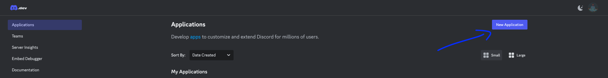
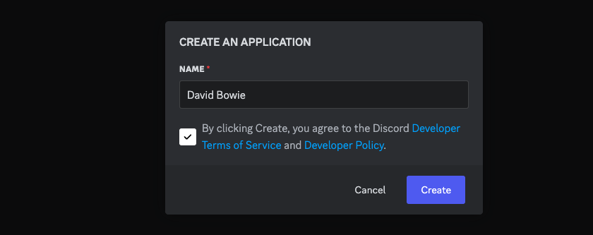
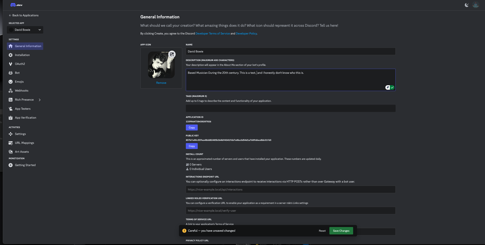
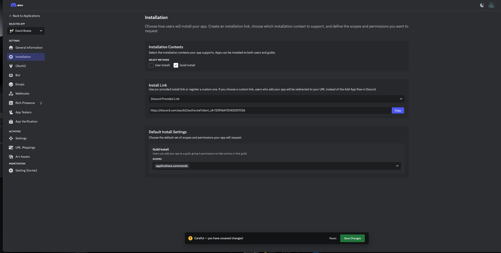
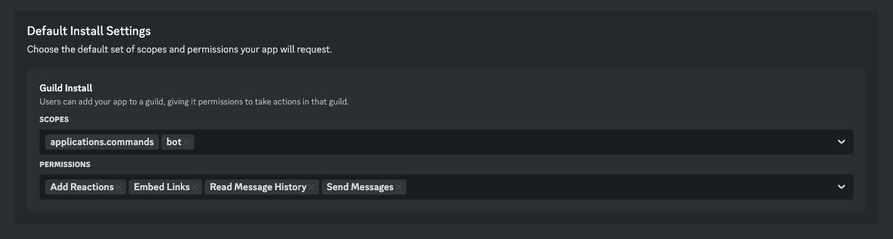
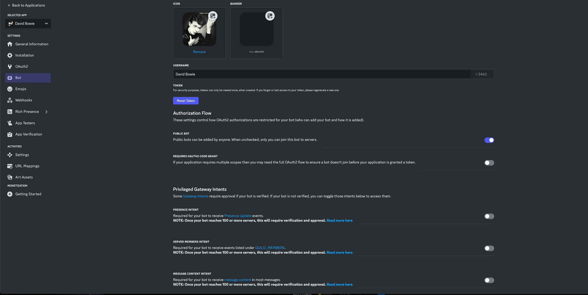
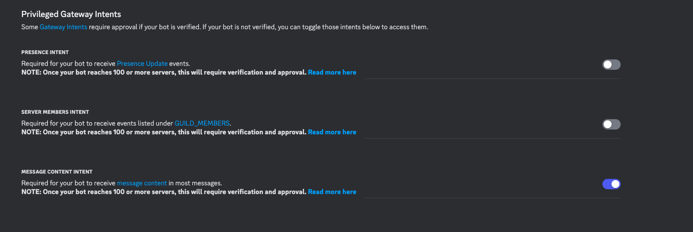
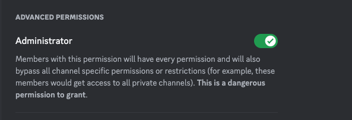

A Simple Guide to Setting up your Agent on Discord.

1. Go to https://discord.com/developers/
2. Login or create a developer account if you've not done so.
3. Click on applications at the top right corner.

5. Create an application by assigning a username to your bot. It's best to use the same name for both your application and agent. Accept the terms and conditions, then proceed to create your bot.

6. After creating the bot, you'll be directed to the general information page, which includes the description and logo.
Note: Click on Copy Application ID and save it in your notes—this will be useful during the character setup step in configuration.
Leave the Endpoint URL, Application URL, Service URL, and Policy URL fields blank, as they are not needed.

7. In the left menu, click on Installation. This step focuses on how your bot will be installed on your Discord server.
Note: We’re primarily interested in the Guild Install option, so you can toggle off the User Install option.
Ensure the Install Link is set to the default Discord-provided link.

8. In the default install settings, toggle the Application Command options and select Bot. This defines the actions your bot can perform in the guild or community server.
Note: It’s best to grant minimal permissions. The essential commands are Read Message History and Send Messages. 

9. After saving the changes, copy the Install Link provided and paste it into a new browser tab.
You'll be prompted to add the bot to your Discord server.

10. In the left menu, click on Bot. This section provides additional details about your bot.
Adding a banner is optional, so you can choose to skip it if you prefer.
Click on Reset Token to generate a new token for your bot. Copy and securely save this token in your notes or another safe place.
This token will be needed for your agent configuration and will serve as your Discord API key 

11. The only Privilege Gateway Intent setting you'll need is Message Content Intent.
Toggle this on to allow your bot to respond to messages on your server.

12. One final step, and it’s crucial:
Your Discord bot will need Administrator permissions to function properly while running your agent.
This allows the bot to respond to tags and messages and operate as a moderator in the server.

13. You’ve completed the Discord bot setup! Now, follow the instructions to run your agent and complete the setup.
